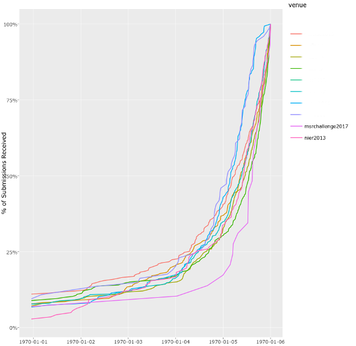

# Paper Submission Date Plotter (PaSDP)
(c) Moritz Beller, 2017

An R script that generates an interactive plot of the last 5 days before
(possibly several) conference submission deadlines (including some ugly system
magic that only works on Unix-oid systems), allowing you to compare last day 
submission behavior across venues, and infer how many submissions you can expect 
this year. This might be helpful to, e.g. early on increase the number of your
reviewers.




# How to use
The script expects its input to be in files named `<venue>-arrivals.csv`. Every
venue should have its own file. This file should contain a parseable version of
every single submission time, like so:

```
"Dec 14, 13:30"
"Jan 15, 22:16"
```

When you use EasyChair, it is very easy to extract these dates. On the site
`All submissions`, execute the xpath `//td/span` (or, this data miner receipe:
https://data-miner.io/recipe/54314)
